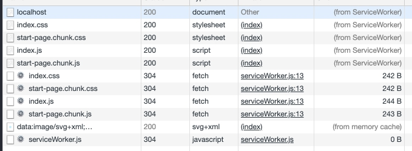

# SSR. Pros and cons.
SSR stands for Server Side Rendering. SSR is a technique for rendering apps on the server and 
then sending a fully rendered page to the client.
Two main benefits of SSR are performance benefit and SEO optimization.

Let`s go to details.

## Performance benefit.
Difference between SSR and CSR (client-side rendering):


For SSR we have rendered html with links to scripts in the browser. For CSR case we have only links 
to scripts. It means that the user will see some content faster with SSR scenario. The initial page 
loading is faster.
But it is theoretical performance benefit because SSR work speed affects from internet speed of 
the user making the request, the physical location of server and count of users which are trying to
 access the site.

## SEO optimization.
One the benefit of using SSR is in having an app that can be crawled for its content even for 
crawlers that don’t execute JavaScript code. This can help with SEO and providing metadata to social media channels.

Page source for start page of create-react-app:

```html
<!DOCTYPE html>
<html lang="en">
<head>
    <meta charset="utf-8" />
    <link rel="shortcut icon" href="/favicon.ico" />
    <meta name="viewport" content="width=device-width, initial-scale=1" />
    <meta name="theme-color" content="#000000" />
    <!--
manifest.json provides metadata used when your web app is installed on a
user's mobile device or desktop. See https://developers.google.com/web/fundamentals/web-app-manifest/
-->
    <link rel="manifest" href="/manifest.json" />
    <!--
Notice the use of in the tags above.
It will be replaced with the URL of the `public` folder during the build.
Only files inside the `public` folder can be referenced from the HTML.

Unlike "/favicon.ico" or "favicon.ico", "/favicon.ico" will
work correctly both with client-side routing and a non-root public URL.
Learn how to configure a non-root public URL by running `npm run build`.
-->
    <title>React App</title>
</head>
<body>
    <noscript>You need to enable JavaScript to run this app.</noscript>
    <div id="root"></div>
    <!--
This HTML file is a template.
If you open it directly in the browser, you will see an empty page.

You can add webfonts, meta tags, or analytics to this file.
The build step will place the bundled scripts into the <body> tag.

To begin the development, run `npm start` or `yarn start`.
To create a production bundle, use `npm run build` or `yarn build`.
-->
    <script src="/static/js/bundle.js"></script>
    <script src="/static/js/0.chunk.js"></script>
    <script src="/static/js/main.chunk.js"></script>
</body>
</html>
```

And the page source for the same page with ssr:
```html
<!doctype html>
<html lang="en">
   <head>
      <meta charset="UTF-8">
      <meta name="viewport" content="width=device-width, initial-scale=1, shrink-to-fit=no" />
      <title>Simple weather app</title>
      <link href="index.css" rel="stylesheet" />
      <link href="start-page.chunk.css" rel="stylesheet" />
   </head>
   <body>
      <div id="root">
         <div class="App">
            <header class="App-header">
               
               <p>Edit <code>src/App.js</code> and save to reload.</p>
               <a class="App-link" href="https://reactjs.org" target="_blank" rel="noopener noreferrer">Learn React</a>
            </header>
         </div>
      </div>
      <script src="index.js"></script>
      <script src="start-page.chunk.js"></script>
   </body>
</html>
```
As we can see in first snippet we have only links to scripts in the body tag and in second snippet we see rendered html and links to scripts. Second scenario is good for SEO bot, it can read context of page. 

## SSR cons.
SSR is no a silver bullet for all use cases. Major cons of SSR are frequent server requests and 
full page reloads.

In conclusion, this is the quote of Adam Zerner:
>SSR is analogous to you driving over to the supermarket every time you want to eat.
With client-side rendering, you go to the supermarket once and spend 45 minutes walking around buying a bunch of food for the month. Then, whenever you want to eat, you just open the fridge.

# Migrating create-react-app to SSR.
Let's start create-react-app (CRA).
```bash
$ npx create-react-app cra-with-ssr
$ cd cra-with-ssr
$ npm start
```
Go to http://localhost:3000/ in the browser. If we go to page source, we can see that html is almost 
empty, 
CRA has only links to scripts. Our goal is getting rendered page from page. 

Go to the project. 
Let`s change some structure. Add server folder. The folder will contain entry point for server bundle. Add common folder. the folder will contain common components for client and server bundle.

```
.
└── src
    ├── common
    │   ├── App.css
    │   ├── App.js
    │   └── logo.svg
    ├── index.css
    ├── index.js
    └── server
        └── index.js
```
Change the path to App component and replace render to hydrate method (indicates to the DOM renderer
 that we’re rehydrating the app after a server-side render) in src/index.js
```javascript
import React from 'react';
import ReactDOM from 'react-dom';
import './index.css';
import App from './common/App';

ReactDOM.hydrate(<App />, document.getElementById('root'));
````
Let`s go to configure server. Install Express:
```bash
$ npm install express
```
Here is content for src/server/index.js:
```javascript
import express from "express";
import React from "react";
import { renderToString } from "react-dom/server";
import fs from "fs";
import App from "../common/App";

const PORT = 3000;
const server = express();

server.use("^/$", (req, res) => {
  //render app to string
  const html = renderToString(<App />);

  fs.readFile("build/index.html", "utf8", (err, data) => {
    if (err) {
      console.error("Something went wrong:", err);
      return res.status(500).send("Oops, better luck next time!");
    }
    //inject app`s static contents to the div with id equal root
    return res.send(
      data.replace('<div id="root"></div>', `<div id="root">${html}</div>`)
    );
  });
});

//serve contents from build directory as static files
server.use(express.static("build"));

server.listen(PORT, () => {
  console.log(`Server is listening on port ${PORT}`);
});
```
We have the command for build client bundle by default. It is `$ npm build` command. 
Now, let`s configure webpack for create server bundle.
Install dev dependencies:
```bash
 npm i webpack-cli nodemon webpack-node-externals --save-dev
 ```
 Add `webpack.server.js` to root of project.
 This is content of `webpack.server.js`:
 ```javascript
 const path = require('path');
const webpackNodeExternals = require('webpack-node-externals');

const config = {
  target: 'node',
  entry: './src/server/index.js',
  output: {
    filename: 'bundle.js',
    path: path.resolve(__dirname, 'build-server')
  },
  externals: [webpackNodeExternals()],
  module: {
    rules: [
      {
        test: /\.js$/,
        exclude: /node_modules/,
        use: {
          loader: 'babel-loader',
          options: {
            babelrc: false,
            presets: [
              '@babel/preset-env',
              '@babel/preset-react'
            ]
          }
        }
      },
      {
        test: /\.(gif|jpe?g|png|ico)$/,
        use: [
          {
            loader: 'url-loader',
            options: {
              limit: 10000,
            },
          },
        ]
      },
      {
        test: /\.(otf|eot|svg|ttf|woff|woff2).*$/,
        use: [
          {
            loader: 'url-loader',
            options: {
              limit: 10000,
            },
          },
        ]
      },
      {
        test: /\.css$/i,
        use: ['css-loader'],
      }
    ]
  }
};

module.exports = config;
 ```
This config says that entry point is `./src/server/index.js`, output is `./build-server` directory with `bundle.js` server bundle.

Next, we should add commands for start server.
```json
{
     "scripts": {
        "start": "react-scripts start",
        "start-server": "npm run clean-build-folders && npm run build && npm run build-server && npm run run-server",
        "build-server": "NODE_ENV=development webpack --config webpack.server.js --mode=development",
        "run-server": "nodemon ./build-server/bundle.js",
        "clean-build-folders": "rm -rf ./build/ && rm -rf ./build-server/",
        "build": "react-scripts build",
        "test": "react-scripts test",
        "eject": "react-scripts eject"
     }
 }
```
Run in terminal:
```bash
$ npm run start-server
```
After these commands, we should see `Server is listening on port 3000`.
Now, our project structure looks like this:
```
.
├── build
│   └── ...
├── build-server
│   └── bundle.js
├── package.json
├── package-lock.json
├── public
│   ├── favicon.ico
│   ├── index.html
│   └── manifest.json
├── README.md
└── src
    ├── common
    │   ├── App.css
    │   ├── App.js
    │   └── logo.svg
    ├── index.css
    ├── index.js
    └── server
        └── index.js
```
Go to http://localhost:3000/.
In page source we can see rendered html inside `<div id="root"></div>`.
```html
<!doctype html>
<html lang="en">
   <head>
      <meta charset="utf-8"/>
      <link rel="shortcut icon" href="/favicon.ico"/>
      <meta name="viewport" content="width=device-width,initial-scale=1"/>
      <meta name="theme-color" content="#000000"/>
      <link rel="manifest" href="/manifest.json"/>
      <title>React App</title>
      <link href="/static/css/main.2cce8147.chunk.css" rel="stylesheet">
   </head>
   <body>
      <noscript>You need to enable JavaScript to run this app.</noscript>
      <div id="root">
         <div class="App" data-reactroot="">
            <header class="App-header">
               
               <p>Edit <code>src/App.js</code> and save to reload.</p>
               <a class="App-link" href="https://reactjs.org" target="_blank" rel="noopener noreferrer">Learn React</a>
            </header>
         </div>
      </div>
      <script>//this contains runtime script</script>
      <script src="/static/js/2.b41502e9.chunk.js"></script>
      <script src="/static/js/main.c9fd7423.chunk.js"></script>
   </body>
</html>
```
SSR is integrated.
Let`s go to code splitting.

## Code splitting.


Code splitting is a technique which allows creating some count of little chunks instead of a single 
huge bundle. CRA has code splitting by default. When we run `$ npm run build` we can see in `./build/static/js/` folder some count of chunks. But CRA load all chunks for every route. 

Let\`s add routes for check it.
Change some project structure for `./src/common/`
Create `notFoundPage` and `startPage` folders. Folder `startPage` should contains our default CRA `App` component but we rename this to `StartPage`. Add `notFoundPage` folder with `NotFound` component.
Now we have this structure :
```
.
└── src
    ├── common
    │   ├── App.js
    │   ├── notFoundPage
    │   │   ├── NotFound.css
    │   │   └── NotFound.js
    │   └── startPage
    │       ├── logo.svg
    │       ├── StartPage.css
    │       └── StartPage.js
    ├── index.css
    ├── index.js
    └── server
        └── index.js
```
`NotFound.js`:
```javascript
import React from 'react';

import './NotFound.css';

const NotFound = () => {
  return (
    <div className='main-wrapper'>
      <div className={'title-wrapper'}>
        <h1>404</h1>
        <p>page not found</p>
      </div>
    </div>
  );
};

export default NotFound;
```
`NotFound.css`:
```css
.main-wrapper {
  position: relative;
  height: 100vh;
  background: linear-gradient(
          135deg,
          #1e5799 0%,
          #207cca 32%,
          #207cca 32%,
          #2989d8 50%,
          #1e5799 97%,
          #7db9e8 100%
  );
}

.title-wrapper {
  position: absolute;
  top: 50%;
  left: 50%;
  margin-right: -50%;
  transform: translate(-50%, -50%);
  text-transform: uppercase;
  text-align: center;
  color: white;
  font-weight: bold;
}

.title-wrapper h1 {
  font-size: 5rem;
  margin: 0;
}

.title-wrapper p {
  font-size: 2rem;
  margin: 0;
}
```
`App.js`:
```javascript
import React from 'react';
import { Switch, Route } from 'react-router-dom';
import startPage from './startPage/StartPage';
import notFoundPage from './notFoundPage/NotFound';

const App = () => (
  <Switch>
    <Route exact path="/" component={startPage} />
    <Route component={notFoundPage} />
  </Switch>
);

export default App;
```
Install `react-route-dom`
```bash
$ npm i react-router-dom
```
Also we should add StaticRouter to server.
`.src/server/index.js`:
```javascript
import express from 'express';
import React from 'react';
import { renderToString } from 'react-dom/server';
import { StaticRouter } from 'react-router-dom';
import fs from 'fs';
import App from '../common/App';

const PORT = 3000;
const server = express();

server.use('/', (req, res) => {
  const context = {};
  const html = renderToString(
    <StaticRouter location={req.url} context={context}>
      <App />
    </StaticRouter>
  );

  fs.readFile('build/index.html', 'utf8', (err, data) => {
    if (err) {
      console.error('Something went wrong:', err);
      return res.status(500).send('Oops, better luck next time!');
    }
    return res.send(
      data.replace('<div id="root"></div>', `<div id="root">${html}</div>`)
    );
  });
});

server.use(express.static('build'));

server.listen(PORT, () => {
  console.log(`Server is listening on port ${PORT}`);
});
```
Now when we start server `$ npm start-server` we can see  in http://localhost:3000/ and 
http://localhost:3000/not-found page sources that included chunks are equal. It is mean that all 
chunks loads for all pages. 

## Code-splitting with react-loadable
For load only need chunks for each route we can use dynamic import ( [dynamic import() describe](https://v8.dev/features/dynamic-import)) with react-loadable ( [react-loadable source](https://github.com/jamiebuilds/react-loadable) ) library.
Install `react-loadable`, `react-loadable-ssr-addon` and `extract-css-chunks-webpack-plugin`:
```bash
$ npm i react-loadable react-loadable-ssr-addon extract-css-chunks-webpack-plugin
```
Default CRA build client logic does not fit for our goal. Let\`s create separate webpack config 
for building client.
`webpack.client.js`:
```javascript
const path = require('path');
const ReactLoadableSSRAddon = require('react-loadable-ssr-addon');
const ExtractCssChunks = require("extract-css-chunks-webpack-plugin");

module.exports = {
  target: 'web',
  entry: {
    index: './src/index.js',
  },
  output: {
    publicPath: '/dist/',
    filename: '[name].js',
    chunkFilename: '[name].chunk.js',
    path: path.join(__dirname, 'dist')
  },
  module: {
    rules: [
      {
        test: /\.js$/,
        exclude: /node_modules/,
        use: {
          loader: 'babel-loader',
          options: {
            babelrc: false,
            presets: [
              '@babel/preset-env',
              '@babel/preset-react'
            ],
            plugins: [
              '@babel/plugin-syntax-dynamic-import',
              'react-loadable/babel'
            ]
          }
        }
      },
      {
        test: /\.(gif|jpe?g|png|ico)$/,
        use: [
          {
            loader: 'url-loader',
            options: {
              limit: 10000,
            },
          },
        ]
      },
      {
        test: /\.(otf|eot|svg|ttf|woff|woff2).*$/,
        use: [
          {
            loader: 'url-loader',
            options: {
              limit: 10000,
            },
          },
        ]
      },
      {
        test: /\.css$/,
        use: [
          {
            loader:ExtractCssChunks.loader
          },
          "css-loader"
        ]
      }
    ]
  },
  optimization: {
    nodeEnv: 'development',
    splitChunks: {
      cacheGroups: {
        commons: {
          test: /[\\/]node_modules[\\/]/,
          name: 'vendors',
          chunks: 'all',
          minChunks: 2,
        },
        default: {
          minChunks: 2,
          reuseExistingChunk: true,
        },
      },
    }
  },
  plugins: [
    new ReactLoadableSSRAddon({
      filename: 'react-loadable-ssr-addon.json',
    }),
    new ExtractCssChunks(
      {
        filename: "[name].css",
        chunkFilename: "[name].chunk.css"
      }
    ),
  ]
};
```
We have this entry point `./src/index.js`, output `./dist` folder. We customized `optimization.splitChunks` ( [more about splitChunks in Webpack 4](https://webpack.js.org/plugins/split-chunks-plugin/#optimizationsplitchunks) ) and added `ReactLoadableSSRAddon` ( [source](https://github.com/themgoncalves/react-loadable-ssr-addon) ) plugin for creating chunks scheme and `ExtractCssChunks` ( [source](https://github.com/faceyspacey/extract-css-chunks-webpack-plugin) ) plugin for handling css chunks.
Also we need add `@babel/plugin-syntax-dynamic-import` and `react-loadable/babel` plugins for `babel-loader` to `webpack
.server.js`:
```javascript
module: {
  rules: [
    {
      test: /\.js$/,
      exclude: /node_modules/,
      use: {
        loader: "babel-loader",
        options: {
          babelrc: false,
          presets: ["@babel/preset-env", "@babel/preset-react"],
          plugins: [
            "@babel/plugin-syntax-dynamic-import",
            "react-loadable/babel"
          ]
        }
      }
    }
    // another rules
  ];
}
```

Let\`s add `react-loadable` to our app.
`App.js`:
```javascript
import React from 'react';
import Loadable from "react-loadable";
import { Switch, Route } from 'react-router-dom';

const StartPageLoadable = Loadable({
  loader: () => import(/* webpackChunkName: "start-page" */'./startPage/StartPage'),
  loading() {
    return <div>Loading...</div>
  }
});

const NotFoundPageLoadable = Loadable({
  loader: () => import(/* webpackChunkName: "not-found-page" */'./notFoundPage/NotFound'),
  loading() {
    return <div>Loading...</div>
  }
});

const App = () => (
  <Switch>
    <Route exact path="/" component={StartPageLoadable} />
    <Route component={NotFoundPageLoadable} />
  </Switch>
);

export default App;
```
Let\`s add `build-client` and change `start-server` commands in `package.json`:
```json
{
 "scripts": {
    "start": "react-scripts start",
    "start-server": "npm run clean-build-folders && npm run build-client && npm run build-server && npm run run-server",
    "build-server": "NODE_ENV=development webpack --config webpack.server.js",
    "run-server": "nodemon ./build-server/bundle.js",
    "build-client": "NODE_ENV=development webpack --config webpack.client.js",
    "clean-build-folders": "rm -rf ./build/ && rm -rf ./build-server/ && rm -rf ./dist/",
    "build": "react-scripts build",
    "test": "react-scripts test",
    "eject": "react-scripts eject"
  }
}
```
Now, when we run `$ npm run build-client` we can see js and css chunks in `./dist` folder:
```
.
└── dist
    ├── not-found-page.chunk.css
    ├── start-page.chunk.css
    ├── index.css
    ├── index.js
    ├── not-found-page.chunk.js
    ├── react-loadable-ssr-addon.json
    └── start-page.chunk.js
```
This we have common for all pages chunks (`index.js` and `index.css`) and separate chunks for 
each page. `react-loadable-ssr-addon.json` contains info what chunks need use for the particular 
page.
Next, we should should change `./src/index.js`:
```javascript
import React from 'react';
import ReactDOM from 'react-dom';
import { BrowserRouter } from 'react-router-dom';
import Loadable from 'react-loadable';
import App from './common/App';

import './index.css';

window.onload = () => {
  Loadable.preloadReady().then(() => {
    ReactDOM.hydrate(
      <BrowserRouter>
        <App/>
      </BrowserRouter>,
      document.getElementById('root')
    );
  });
};
```
We use the `Loadable.preloadReady()` method on the client to preload the loadable components that were included on the page. The method returns a promise, which on resolution means that we can hydrate our app.
Change `./src/server/index.js`:
```javascript
import express from 'express';
import React from 'react';
import { renderToString } from 'react-dom/server';
import Loadable from 'react-loadable';
import { getBundles } from 'react-loadable-ssr-addon';
import { StaticRouter } from 'react-router-dom';
import App from '../common/App';

import manifest from  '../../dist/react-loadable-ssr-addon';

const PORT = 3000;
const server = express();

server.use(express.static('dist'));

server.use('/', (req, res) => {
  const modules = new Set();
  const context = {};

  const html = renderToString(
    <Loadable.Capture report={moduleName => modules.add(moduleName)}>
      <StaticRouter location={req.url} context={context}>
        <App />
      </StaticRouter>
    </Loadable.Capture>
  );

  const bundles = getBundles(manifest, [
    ...manifest.entrypoints,
    ...Array.from(modules)
  ]);

  const scripts = bundles.js || [];
  const styles = bundles.css || [];

  res.send(`
    <!doctype html>
    <html lang="en">
    <head>
        <meta charset="UTF-8">
        <meta name="viewport" content="width=device-width, initial-scale=1, shrink-to-fit=no" />
        <title>Simple weather app</title>
        ${styles.map(style => {
    return `<link href="${style.file}" rel="stylesheet" />`;
        }).join('\n')}
    </head>
    <body>
        <div id="root">${html}</div>
        ${scripts.map(script => {
        return `
          <script src="${script.file}"></script>`; }).join(' ')
        }
    </body>
    </html>
  `);
});

// Loadable.preloadAll method returns a promise that will resolve when all your loadable components are ready.
Loadable.preloadAll()
  .then(() => {
    server.listen(PORT, () => {
      console.log(`Running on http://localhost:${PORT}/`);
    });
  })
  .catch(err => {
    console.log(err);
  });
```
After this, when we start server `$ npm run start-server` and go to page source of 
http://localhost:3000/, we can see that only chunks for this page are loaded.

```html
<!doctype html>
<html lang="en">
   <head>
      <meta charset="UTF-8">
      <meta name="viewport" content="width=device-width, initial-scale=1, shrink-to-fit=no" />
      <title>Simple weather app</title>
      <link href="index.css" rel="stylesheet" />
      <link href="start-page.chunk.css" rel="stylesheet" />
   </head>
   <body>
      <div id="root">
         <div class="App">
            <header class="App-header">
               
               <p>Edit <code>src/App.js</code> and save to reload.</p>
               <a class="App-link" href="https://reactjs.org" target="_blank" rel="noopener noreferrer">Learn React</a>
            </header>
         </div>
      </div>
      <script src="index.js"></script> 
      <script src="start-page.chunk.js"></script>
   </body>
</html>
```
We can see this link to `index.css` and `start-page.chunk.css` styles. `index.css` are common 
styles for all pages and `start-page.chunk.css` are styles only for start page. Similar situation
 is with js files. We have common logic for all pages `index.js` and logic only for start page in
 `start-page.chunk.js` file. 
 In page source of http://localhost:3000/not-found we can see:
 ```html
 <!doctype html>
 <html lang="en">
    <head>
       <meta charset="UTF-8">
       <meta name="viewport" content="width=device-width, initial-scale=1, shrink-to-fit=no" />
       <title>Simple weather app</title>
       <link href="index.css" rel="stylesheet" />
       <link href="not-found-page.chunk.css" rel="stylesheet" />
    </head>
    <body>
       <div id="root">
          <div class="main-wrapper">
             <div class="title-wrapper">
                <h1>404</h1>
                <p>page not found</p>
             </div>
          </div>
       </div>
       <script src="index.js"></script> 
       <script src="not-found-page.chunk.js"></script>
    </body>
 </html>
 ```
 This we can see chunks only for not found page.
 
 Let`s add Service Worker (SW) to our app.
 
 ## SW to SSR
 Go to http://localhost:3000/ and open `network` tab in Debugger. Refresh page. As we can see, we get 
 all files from the server each time when we refresh the page, no one files keeps on the client. 
 Service 
 Worker helps us cashing files and requests from the server.
 Add this snippet to `./src/server/index.js` before `</body>`:
 ```html
 <script>
    if ('serviceWorker' in navigator) {
        window.addEventListener('load', () => {
            navigator.serviceWorker.register('/serviceWorker.js');
        });
    }
 </script>
 ```
This snippet needs for registration SW and in this snippet we can see that logic for SW is 
included in `serviceWorker.js` file. Note `/serviceWorker.js` means that our file should locate 
in static folder. In our case static folder `dist`, because we chosen this folder earlier in this
 line `server.use(express.static('dist'));`. `dist` is temporally folder for our project and we 
 clean the folder each time when start server. We need add command for copying `serviceWorker.js`
  file from root of our project to `./dist` and change `start-server` command. 
  
  Now our `scripts` in `package.json` looks like this:
  ```json
  {
      "scripts": {
        "start": "react-scripts start",
        "start-server": "npm run clean-build-folders && npm run build-client && npm run build-server && npm run copy-sw-to-dist-folder && npm run run-server",
        "build-server": "NODE_ENV=development webpack --config webpack.server.js",
        "run-server": "nodemon ./build-server/bundle.js",
        "build-client": "NODE_ENV=development webpack --config webpack.client.js",
        "copy-sw-to-dist-folder": "cp serviceWorker.js dist",
        "clean-build-folders": "rm -rf ./build/ && rm -rf ./build-server/ && rm -rf ./dist/",
        "build": "react-scripts build",
        "test": "react-scripts test",
        "eject": "react-scripts eject"
      }
  }
  ```
Add this content to `./serviceWorker.js`:
```javascript
const CACHE_NAME = 'cache-token';
const urlsToCache = ['/'];

// eslint-disable-next-line no-restricted-globals
self.addEventListener('install', event => {
  event.waitUntil(
    caches.open(CACHE_NAME).then(cache => cache.addAll(urlsToCache))
  )
});
// eslint-disable-next-line no-restricted-globals
self.addEventListener('fetch', event => {
  event.respondWith(
    caches.match(event.request).then(response => response || fetch(event.request))
  );
});
```
In this file we say to SW to cache all files from static folder and to cache requests.
Now, when we run the command `$ npm run start-server`, go to http://localhost:3000/ and open 
`network` in 
Debugger we can see that after refreshing page we use cached files instead of receiving 
files from the server.

Before (without SW):


After (with SW):



We achieved our goals: added SSR to CRA, slitted code and integrated SW.
You can find the repository with code from the guide this https://github.com/dzianisbohush/cra-with-ssr
